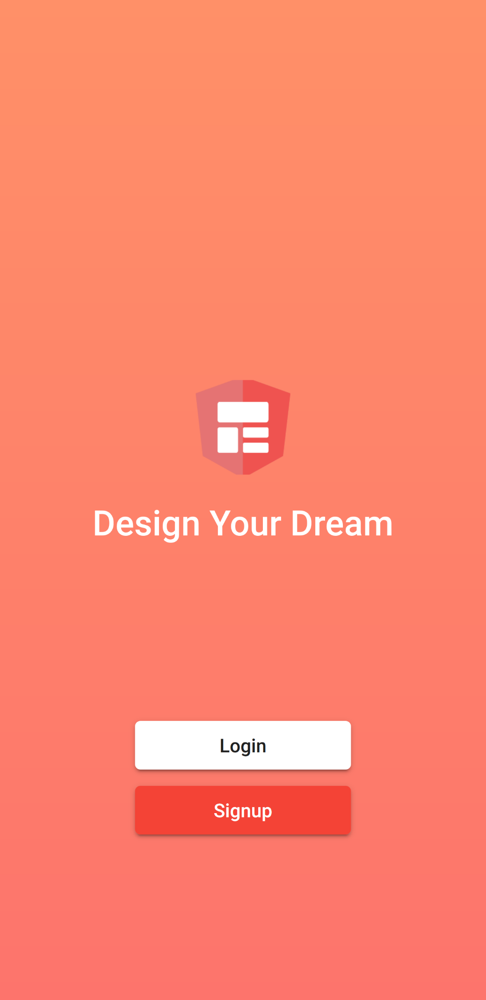

# First angular material ionic 4 app

You can clone it and then run the command "npm install"

For more details go to my blog https://sbsharma.com/angular-material-design-with-ionic-4/

# Final output will be

# Live Demo
[Ionic 4 Angular material design](https://sbsharma.com/angular-material-design-with-ionic-4/)

# Support us
To support my free tutorials and source code you can consider your next hosting purchase with my affiliate link. It will not cost you anything extra but it will give me a small amount of commission. Here is my Hostinger affilate link [Hostinger](https://www.hostg.xyz/SH6KQ).

# Contributor
[Satpal Bhardwaj](https://sbsharma.com/ionic/)

# Follow us

